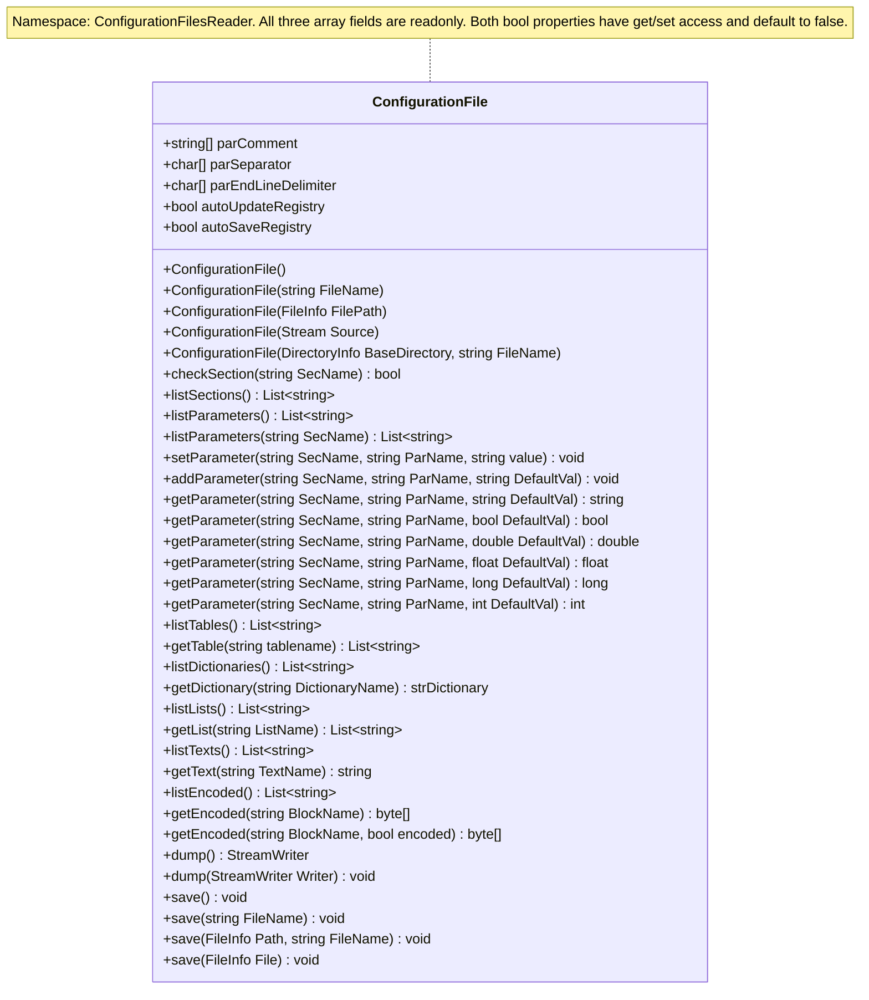

# IniLike

IniLike is a standalone C# library for reading INI-like configuration files organized into typed blocks.
It targets .NET Framework 3.5. 
The namespace and assembly name are **ConfigurationFilesReader**, and the public class is `ConfigurationFilesReader.ConfigurationFile`.

The implementation uses one partial class across nine source files in
`ConfigurationFilesReader/`: `ConfigurationFile.cs` holds shared settings and
constructors; `ConfigurationFile.Parsing.cs` handles block identification and loading;
`ConfigurationFile.Persistence.cs` handles dump/save and round-trip validation.
`ConfigurationFile.Sections.cs`, `ConfigurationFile.Tables.cs`,
`ConfigurationFile.Dictionaries.cs`, `ConfigurationFile.Lists.cs`,
`ConfigurationFile.Texts.cs` and `ConfigurationFile.Encoded.cs` hold the
respective storage and access methods, including parameter methods in Sections.

The parser represents block kinds with the private `BlockTypes` enum and maps
those kinds to their identifiers and aliases in the private readonly
`blockIdentifiers` dictionary. The include kind is `BlockTypes.Include`, following
the same capitalization as `Section`, `Table`, `List`, `Dictionary`, `Text` and
`Encoded`. File identifiers remain uppercase (`INCLUDE`, `INC`, `INPUT`, `LINK`,
`LOAD`); `BlockTypes.None` represents the state outside a block and is associated
with the `END` marker.

## File format

A **block** is the general unit introduced by a bracketed header. A **section** is
specifically a key/value block (`[NAME]`, `[SEC:NAME]` or `[SECTION:NAME]`). Tables,
lists, dictionaries, text, encoded data and includes are other block types.

```ini
## Full-line comment
[SERVER]
host = localhost;
port = 8080;
enabled = TRUE;

[DIRECTORIES]
data = ./data/;

[TABLE:ITEMS]
first; 10; active;
second; 20; inactive;
```

- `[NAME]`, `[SEC:NAME]` and `[SECTION:NAME]` are equivalent headers for section blocks
  containing `key = value` pairs.
- `[TABLE:NAME]`, `[TBL:NAME]` and `[TAB:NAME]` are equivalent table headers containing text rows.
  The library returns a `List<string>`;
  callers are responsible for splitting rows into columns.
- `[LIST:NAME]` and `[LST:NAME]` are equivalent list headers. Every data line is
  one string item: `mach1;` becomes `mach1`, and `x1=mach1.volt1` remains the
  complete string `x1=mach1.volt1`. Items are not parsed as key/value pairs;
  order and duplicates are preserved. Lists use the same whitespace trimming,
  trailing delimiters and full-line comment rules as tables.
- `[DICT:NAME]` and `[DICTIONARY:NAME]` are equivalent dictionary headers.
  Entries are string keys and string values: `x = 3` stores `"3"`, and
  `y = 3.14` stores `"3.14"`. They use the same key/value parsing, trimming and
  comment rules as sections, including ignoring lines without exactly one `=`.
  Duplicate keys throw; keys differing in case remain distinct.
- `[TEXT:NAME]` and `[TXT:NAME]` are equivalent plain-text block headers.
  Content supports Unicode and preserves whitespace, blank lines, `##` comment-looking
  lines, `=` and trailing punctuation. Any bracketed header starts a new block,
  just as in lists; `[END]` or `[END:NAME]` closes the text block. Header recognition
  uses trimmed lines, so bracketed lines cannot be stored as literal text.
  Text blocks have their own case-sensitive name space. `getText(name)` returns
  their lines joined with `\n` (without an added final newline); original CR/LF
  line-ending style is not retained. Empty and missing blocks return `""`;
  `listTexts()` distinguishes an existing empty block from a missing one.
- `[ENCODED:NAME]` and `[ENC:NAME]` contain one Base64-encoded binary payload.
  `[BASE64:NAME]` and `[B64:NAME]` remain accepted aliases for the same block type.
  Data may span multiple lines, even within a four-character group. Blank lines
  and full-line comments are ignored; spaces, tabs and line breaks within the
  encoded data are accepted. Padding `=` is retained and punctuation is not
  stripped. Standard Base64 decoding uses `Convert.FromBase64String`; malformed
  input (including URL-safe `-`/`_` variants) throws `FormatException` during loading,
  with the block name in the diagnostic. Empty blocks decode to an empty byte array.
  `getEncoded(name)` returns decoded bytes, without interpreting them as text.
  Encoded blocks have their own case-sensitive name space and follow the same
  header transitions and optional `END` markers as lists.
- `[INCLUDE:filename.ini]` loads another configuration file into the current
  registry. `INC`, `INPUT`, `LINK` and `LOAD` are equivalent identifiers. Absolute
  paths are accepted; relative paths (including nested includes) resolve from the
  process's current working directory, not the including file's directory.
  Filenames are trimmed but are not quoted or stripped of punctuation.
  Included files use the same parser settings and have independent block state;
  their contents cannot continue a block in the including file. All block types
  share their existing namespaces across files, so duplicate block names still throw.
  Include blocks are processed immediately and are not stored in a block registry. Following
  non-header lines are ignored until the next block, and `END` is optional.
  `[END:filename.ini]` must match the trimmed filename as written in the include
  header, using the usual case-sensitive label check. Missing/unreadable files
  and parsing errors propagate. Empty filenames and include cycles throw
  `FormatException`; nesting is limited to 128 simultaneously open files to
  prevent unbounded recursion through filesystem aliases. Repeated non-recursive
  includes are processed again and are subject to normal duplicate checks.
- Any block may end with `[END]` or `[END:NAME]`. The closing name, when supplied
  for an active block, must match its name (after trimming); a mismatch throws
  `FormatException`. Closing markers do not create blocks or become block content. Subsequent
  data is ignored until another block header. A closing marker outside
  block also resets the parser to that state. Without a closing marker, the
  next block header or end of file ends the block. Saving uses the canonical
  `[NAME]`, `[TABLE:NAME]`, `[LIST:NAME]` and `[DICT:NAME]` forms without closing markers. Text blocks are saved as `[TEXT:NAME]` followed
  by raw content lines and `[END]`. Encoded blocks use `[ENCODED:NAME]` and a single
  canonical Base64 data line without delimiters or an end marker.
- Block names and parameter keys are **case-sensitive**. The `SEC:`, `SECTION:`,
  `TABLE:`, `TBL:`, `LIST:`, `LST:`, `DICT:`, `DICTIONARY:`, `TEXT:`, `TXT:`, `ENCODED:`, `ENC:`, `BASE64:`, `B64:`, `INCLUDE:`, `INC:`, `INPUT:`, `LINK:`, `LOAD:` and `END` keywords
  must be uppercase. Sections, tables, lists, dictionaries, text and encoded blocks have separate name spaces and may
  share a name.
- Outside text blocks, blank lines and lines starting with any nonempty prefix in `parComment` after
  trimming are ignored. The default prefix is `##`. Matching is ordinal and
  case-sensitive, takes precedence over block headers, and applies only
  to full-line comments. Null or empty prefix entries are ignored.
- Outside text content, leading and trailing whitespace is trimmed from lines, block names, keys,
  and values. All trailing `;`, `,`, and `.` characters are then removed from
  values, table rows and list items. Whitespace exposed by removing these delimiters is
  preserved.
- A key/value line must split into **exactly two parts** at `=`. Lines such as
  `expression = a=b;` are ignored.
- Quoting, escaping, multiline values, and inline comments are not supported.
  Quotes remain part of the value. A line such as `; comment` is treated as
  data inside a table.
- Duplicate block names within their respective name spaces, or duplicate keys
  within a section or dictionary, cause an exception. Repeated list items are allowed.
- Lines before the first block header are ignored.
- Relative configuration file paths are resolved against the working directory.
  Paths stored as values are returned as text without resolution.

The trailing `.` delimiter can alter meaningful data: `value...` becomes `value`, and a single `.` becomes an empty string. 
Use `./` to represent the current directory. 
The parser supports the format described here rather than a complete INI specification.

## Usage

Example configuration files are in [`examples/`](examples/):

| File | Demonstrates |
| --- | --- |
| [example.ini](examples/example.ini) | Basic parameters, numeric values and tables. |
| [sections.ini](examples/sections.ini) | Plain, `SEC` and `SECTION` headers; boolean `0`/`1`; optional named and unnamed `END`. |
| [tables.ini](examples/tables.ini) | `TABLE`/`TBL`, test phases, blank columns and empty tables. |
| [lists.ini](examples/lists.ini) | `LIST`/`LST`, plain items and literal assignments, repeated items and empty lists. |
| [dictionaries.ini](examples/dictionaries.ini) | `DICT`/`DICTIONARY`, string key/value entries and optional endings. |
| [texts.ini](examples/texts.ini) | Raw Unicode text, blank lines, punctuation and transitions using `TEXT`/`TXT`. |
| [encoded.ini](examples/encoded.ini) | `ENCODED`/`ENC`, legacy aliases, wrapped Base64 data and empty blocks. |
| [bench.ini](examples/bench.ini) | Combined sections, tables and lists, including shared names across block types. |

Load an example from the repository root with
`new ConfigurationFile("examples/bench.ini")`. Automatic creation and saving are
runtime properties configured in C#; they are not directives in the INI file.

Reference `ConfigurationFilesReader.dll` and use the public API:

```csharp
using ConfigurationFilesReader;
using System.Collections.Generic;

var config = new ConfigurationFile("config.ini") { autoUpdateRegistry = true };
string host = config.getParameter("SERVER", "host", "localhost");
int port = config.getParameter("SERVER", "port", 8080);
bool enabled = config.getParameter("SERVER", "enabled", false);
List<string> items = config.getTable("ITEMS");

// Create or update a parameter in memory. The source file is unchanged.
config.setParameter("DIRECTORIES", "data", "./other-data/");
```

To create a configuration entirely in memory:

```csharp
var config = new ConfigurationFile { autoUpdateRegistry = true };
config.setParameter("SERVER", "port", "8080");
int port = config.getParameter("SERVER", "port", 80);
```

To load directly from a readable stream:

```csharp
using (var stream = System.IO.File.OpenRead("config.ini"))
{
    var config = new ConfigurationFile(stream);
    string host = config.getParameter("SERVER", "host", "localhost");
    config.save("copy.ini");
}
```

`ConfigurationFile(Stream Source)` reads from the current position to the end,
using UTF-8 by default with BOM-based encoding detection, just like file loading.
Non-seekable streams are supported. The caller retains ownership: the stream stays
open on success and on errors, and its position is not restored. Null streams throw
`ArgumentNullException`; unreadable streams throw `ArgumentException`. Parsing and
I/O errors propagate to the caller.

A stream-loaded configuration has no original file, even when passed a `FileStream`.
Saving always requires an explicit destination; automatic creation with
`autoSaveRegistry=true` fails before modifying the registry. Both runtime properties
default to false. The same parser and file-format rules apply to files and streams.

### Including other files

```ini
[INCLUDE:filename.ini]

[INC:config2.ini]
[END]

[LINK:settings/common.ini]
[END:settings/common.ini]
```

Run the application from the directory against which these paths should resolve.
Includes also work when constructing from a stream. Loaded content is available
through the existing getters and listing methods; there is no separate include
registry. Full paths can be used when the working directory is not fixed.

Dump/save writes the combined data as ordinary blocks, replacing include directives
with their loaded content. It never writes back to the included files automatically.
The original save destination remains the top-level file; configurations loaded
from a stream still need an explicit destination. As with other save overloads,
explicitly choosing an included file as a destination replaces that file.

## API reference

The diagram shows the public API of the single partial `ConfigurationFile` class.
Members are ordered by shared settings and constructors, sections/parameters,
tables, dictionaries, lists, and persistence. Parsing remains private.
`strDictionary` in the diagram denotes `Dictionary<string, string>`.



File paths are stored internally as `System.IO.FileInfo`. 
Typed paths can be passed directly or combined with a filename:

```csharp
var fromString = new ConfigurationFile("config.ini");
var fromPath = new ConfigurationFile(new System.IO.FileInfo("config.ini"));
var fromDirectory = new ConfigurationFile(
    new System.IO.DirectoryInfo("settings"), "config.ini");
```

Relative paths are resolved against the working directory when their path objects are created. 

| Member | Behavior |
| --- | --- |
| `autoSaveRegistry` | Public get/set property, false by default. Saves the entire registry to its original file when a new parameter or section is created. Requires `autoUpdateRegistry=true` for creation through parameter methods. |
| `ConfigurationFile(string filename)` | Loads the file immediately. Missing files and parsing errors cause exceptions. |
| `ConfigurationFile(FileInfo FilePath)` | Loads the file represented by the typed path immediately. |
| `ConfigurationFile(Stream Source)` | Loads from the current stream position, leaves it open, and has no original save destination. |
| `ConfigurationFile(DirectoryInfo BaseDirectory, string FileName)` | Combines the directory and filename and loads the resulting file immediately. |
| `ConfigurationFile()` | Creates an empty container without loading a file; automatic creation is disabled. |
| `checkSection(string)` | Checks for a section block, excluding all other block types. Never creates sections or writes files. |
| `getParameter(section, key, string defaultValue)` | Returns the stored text, or the default if the section or key is missing. With `autoUpdateRegistry=true`, stores that missing default, creating the section if needed; also saves it when `autoSaveRegistry=true`. |
| `getParameter(..., bool)` | `TRUE` (case-insensitive) and `1` are true; `FALSE` and `0` are false. Surrounding whitespace is ignored. Other stored values remain false, even when the default is true. |
| `getParameter(..., double/float)` | Parses using invariant culture after replacing commas with periods. Returns the default if parsing fails. |
| `getParameter(..., long/int)` | Parses an integer using invariant culture. Returns the default if parsing fails. The int overload parses as long and then performs an unchecked cast, so values outside the int range can wrap instead of returning the default. |
| `getTable(name)` | Returns an independent `List<string>` snapshot of rows in their stored order, compatible with .NET Framework 3.5. Missing tables return a new empty list. Null throws `ArgumentNullException`. Editing the returned list does not modify the configuration or saved data. |
| `getList(string ListName)` | Returns the mutable internal list of string items. A missing list returns a new, unattached empty list. Null throws `ArgumentNullException`. Never creates a list or triggers saving. |
| `listLists()` | Returns an independent, ordinally sorted snapshot of list block names, excluding all other block types. |
| `getDictionary(string DictionaryName)` | Returns the live `Dictionary<string, string>`. Missing names return an unattached empty dictionary; null throws `ArgumentNullException`. Does not create a registered dictionary. |
| `listDictionaries()` | Returns an independent, ordinally sorted snapshot of dictionary names. |
| `getText(string TextName)` | Returns raw text lines joined with LF, or an empty string for a missing block. Null throws `ArgumentNullException`. Does not create entries or save. |
| `listTexts()` | Returns an independent, ordinally sorted snapshot of text block names. |
| `getEncoded(string BlockName)` | Returns an independent decoded `byte[]`, or an empty array for a missing block. Null throws `ArgumentNullException`. Does not create entries or save. |
| `getEncoded(string BlockName, bool encoded)` | With `false`, returns decoded bytes as above. With `true`, returns canonical Base64 as ASCII bytes in an independent `byte[]`, without line wrapping or comments. Empty/missing blocks return an empty array; null throws `ArgumentNullException`. Does not create entries or save. |
| `listEncoded()` | Returns an independent, ordinally sorted snapshot of encoded block names. |
| `listSections()` | Returns section block names, excluding all other block types. |
| `listParameters(string Section)` | Returns parameter names in the specified section. Missing or empty sections return an empty list; null throws `ArgumentNullException`. |
| `listParameters()` | Returns distinct parameter names across all sections. The same name in multiple sections appears once; names differing in case remain distinct. |
| `listTables()` | Returns table block names, excluding all other block types. |
| `dump()` | Returns a flushed UTF-8 `StreamWriter` backed by a memory stream, positioned at zero for reading. The caller must dispose it. |
| `dump(StreamWriter Writer)` | Writes and flushes the registry at the supplied writer's current position without closing it. Null throws `ArgumentNullException`. |
| `save()` | Saves to the original file. Throws `InvalidOperationException` if constructed without a file. |
| `save(string FileName)` | Saves to the specified path, relative to the current working directory if not rooted. |
| `save(FileInfo Path, string FileName)` | Treats `Path.FullName` as a base directory and combines it with `FileName` using `System.IO.Path.Combine`. A rooted filename overrides the base directory. |
| `save(FileInfo File)` | Saves to the file represented by `File`. |
| `setParameter(string sectionName, string parameterName, string value)` | Replaces an existing value; creates missing sections and keys only when `autoUpdateRegistry=true`. Otherwise missing entries are left unchanged. Stores text without parsing or trimming and preserves case-sensitive names. Newly created entries are saved when `autoSaveRegistry=true`. |
| `addParameter(section, key, defaultValue)` | When `autoUpdateRegistry=true`, adds a missing parameter in memory and creates its section if needed; otherwise makes no changes. Preserves existing values, including null. Stores text unchanged; new entries are saved when `autoSaveRegistry=true`. Null section/key names throw `ArgumentNullException`; empty names are allowed. |


Dictionary contents are accessed separately from section parameters:

```csharp
Dictionary<string, string> channels = config.getDictionary("CHANNELS");
string x = channels["x"]; // "3", with no numeric conversion.
channels["key1"] = "updated";
config.save();
```

`getParameter`, `setParameter`, `addParameter`, `checkSection` and `listParameters`
operate on sections only. Direct dictionary mutations do not trigger automatic
creation or saving; call `save` explicitly. Dictionary names and keys are sorted
ordinally for dump/save, and the same round-trip validation applies to their values.

Text blocks are accessed independently from sections and lists:

```csharp
string notes = config.getText("NOTES");
List<string> textNames = config.listTexts();
```

The returned string is a snapshot; changing a local string does not modify the
configuration. Neither text accessor creates entries or writes files, regardless
of `autoUpdateRegistry` or `autoSaveRegistry`.

Binary data can be retrieved directly:

```ini
[ENCODED:PAYLOAD]
AAEC/4A=
[END:PAYLOAD]
```

```csharp
byte[] payload = config.getEncoded("PAYLOAD"); // 0, 1, 2, 255, 128
byte[] base64 = config.getEncoded("PAYLOAD", true); // ASCII bytes for AAEC/4A=
string base64Text = System.Text.Encoding.ASCII.GetString(base64);
List<string> binaryNames = config.listEncoded();
```

The one-argument overload is equivalent to `getEncoded(name, false)`. Both overloads
return `byte[]`; the flag selects decoded bytes or the Base64 representation.
The returned array is an independent copy; changes to it do not modify the
configuration. Both accessors leave the registry and files unchanged, regardless
of automatic-update/save settings. Use `listEncoded()` to distinguish an empty
block from a missing one. Decoded bytes are retained in memory; dump/save re-encode
them canonically, preserving the bytes rather than the input wrapping or comments.

### Saving

To save newly created entries automatically:

```csharp
var config = new ConfigurationFile("config.ini") {
    autoUpdateRegistry = true,
    autoSaveRegistry = true
};
config.addParameter("SERVER", "newKey", "value");
```

`setParameter`, `addParameter`, and missing-default reads through `getParameter`
trigger a save only when they create a parameter or section. Updating an existing
value, adding an already existing parameter, inspecting sections, changing table
rows, or toggling either property does not trigger a save. A triggered save writes
the entire current registry, including earlier unsaved changes.

Automatic saves always target the original file, even after an explicit save to
another destination. Creating entries with automatic saving enabled on an object
without an original file throws `InvalidOperationException` before changing it.
If saving fails, the new parameter and any section created for it are removed;
earlier in-memory changes remain. Save errors propagate to the caller.

`dump()` serializes the registry without writing a file:

```csharp
using (var dump = config.dump())
using (var reader = new System.IO.StreamReader(dump.BaseStream))
{
    string text = reader.ReadToEnd();
}
```

The returned writer owns its memory stream. Alternatively, `dump(writer)` writes
to a caller-owned `StreamWriter`, preserving its encoding and newline settings.
Dumping uses the same sorted sections, parameters and ordered table rows as saving.
It emits raw registry content without checking whether the parser can reload it;
`save` performs that validation before replacing the destination.

```csharp
config.setParameter("SERVER", "host", "example.com");
config.save(); // Overwrite the original file.
config.save("copy.ini");
config.save(new System.IO.FileInfo("backup.ini"));
config.save(new System.IO.FileInfo("backups"), "config.ini");
```

All overloads save the current in-memory sections, parameters, table rows, list
items, dictionary entries, text blocks and Base64 data.
Explicit destinations do not change the original path used by `save()`. An
in-memory configuration always needs an explicit destination, even after its
first save. Parent directories must already exist; null arguments are rejected.

Output uses UTF-8 without a BOM, ordinally sorted section/parameter/table names,
and the current order of table rows and list items. Comments, source ordering and original
formatting outside text content are not preserved. Text content retains its raw
lines, including whitespace and comment-looking lines. Saving uses the standard `=` separator and `;`
terminator regardless of mutations to the public delimiter arrays; text content
has no added terminators. Base64 data also has no added terminators, and its
decoded bytes are included in round-trip validation.

`save` obtains the serialized bytes from `dump()`, copies them to a temporary file
in the destination directory, closes that file, and reloads it with
the standard parser and checks that all names and values are preserved. Data the
format cannot represent (for example null values, values containing `=`, or
significant trailing punctuation) causes `InvalidOperationException` rather than
a lossy save. No quoting or escaping is introduced.

An existing destination is replaced with `File.Replace`; a new destination is
created with `File.Move`. Failed serialization or validation leaves the destination
untouched and temporary files are cleaned up. Filesystem errors propagate;
replacement requires filesystem support and does not fall back to truncating
the destination. Concurrent changes to a configuration are not supported.

`getTable(name)` returns a fresh row snapshot on every call. Adding, replacing,
removing or clearing its rows affects only that returned list. This changes the
previous behavior that exposed the stored mutable table. The return type remains
`List<string>` and uses APIs available in .NET Framework 3.5. Getting or editing a
snapshot never creates a table or triggers saving, even with automatic updates or
saving enabled. List and dictionary accessors retain their existing live behavior.

## Limitations

The listing methods return independent `List<string>` snapshots sorted with `StringComparer.Ordinal`.
Changing a returned list does not modify the configuration; later in-memory changes are reflected only by a new call. Listing never creates blocks or writes files.
Parameter listings contain names, not values.

Delimiter settings are public readonly fields; `autoUpdateRegistry` is a public
get/set property:

```csharp
char[] separators = config.parSeparator;
char[] delimiters = config.parEndLineDelimiter;
bool automaticUpdates = config.autoUpdateRegistry;
config.autoUpdateRegistry = true;
```

The array references cannot be reassigned, but their elements remain mutable.
The public readonly `parComment` array contains comment prefixes (default `##`).
Changing its elements after construction does not reparse already loaded data;
there is no public reload method or constructor option for custom prefixes.
They default to `=` and `; , .`. Changing them after construction does not reload or change already parsed values. 
There is no public reload method.
`autoUpdateRegistry` defaults to false for every constructor. Set the property to true or false at any time to enable
or disable creation of missing entries. Changing it does not remove existing data
or write files. The delimiter fields have no accessor properties or setter methods.

`setParameter` supports in-memory overrides. Subsequent `getParameter` calls use the new values and the usual type conversions. 
Changes are persisted by explicit `save` calls or when creation triggers automatic saving.

`addParameter` adds defaults only when a parameter is absent and automatic creation
is enabled; `setParameter` also replaces existing values in either mode.
Neither method writes files when `autoSaveRegistry=false` (the default).

The `autoUpdateRegistry` flag controls creation; `autoSaveRegistry` separately controls saving new entries:

| Operation | `autoUpdateRegistry=false` (default) | `autoUpdateRegistry=true` |
| --- | --- | --- |
| `setParameter` | Updates existing parameters; missing entries are skipped. | Updates or creates parameters and their sections. |
| `addParameter` | Makes no changes. | Creates missing parameters and sections; preserves existing values. |
| `getParameter` (all overloads) | Returns defaults without storing them. | Stores missing defaults; later reads use the stored values. |

`checkSection`, `getTable`, and listing methods never create entries. This replaces
the old field name and changes setter creation behavior: callers that previously
relied on unconditional creation must set the property to true before adding entries.
Constructors do not accept an automatic-update argument; object initializers may
be used to set the property immediately after construction.
`checkSection` remains a pure existence check. 
Explicit `save` calls and automatic saves of newly created entries write changes
to disk. Both use the same serialization, validation and replacement procedure.

Internally created readers and writers are disposed through `using` blocks, including on exceptions.
Caller-supplied streams remain open.
Concurrent changes are not synchronized.

## ConfigurationValidator

The console application validates configuration files, lists names and rewrites
configurations to a file or standard output. See the
[ConfigurationValidator guide](ConfigurationValidator/README.md) for build and
usage examples, command-line options, exit codes and example validation.

## Build

With GNU Make and MSBuild installed, build from the repository root:

```sh
make ms-build
```

- `ms-build` is the default target: running `make` alone invokes MSBuild.
- `x-build` explicitly uses the deprecated Mono xbuild tool: `make x-build`.
- `clean` removes both projects' entire `bin` and `obj` directories, including Debug, Release, and stale build artifacts: `make clean`.
- `test` runs the Python test runner, which builds its own temporary copy of the library. 
  Build and test default to Release; select Debug with `CONFIGURATION=Debug`, for example `make test CONFIGURATION=Debug`. 
  Tests also require Python 3; override its command with `PYTHON=python3` if needed.
- `IniLike.sln` contains the library and console validator projects.
  Build it with a toolchain that supports .NET Framework 3.5. 
  MSBuild must have access to the .NET Framework 3.5 reference assemblies and compatible build targets:

```sh
msbuild IniLike.sln /p:Configuration=Release
```

The resulting assembly is
`ConfigurationFilesReader/bin/Release/ConfigurationFilesReader.dll`.

Select build executables with `make ms-build MSBUILD=/path/to/msbuild` or
`make x-build XBUILD=/path/to/xbuild`. These variables accept executable paths,
not commands with arguments. Both build targets support `CONFIGURATION=Debug`.

## Automated tests

Prerequisites: Python 3 and Mono (`mcs` and `mono` on `PATH`), plus MSBuild
or legacy xbuild with .NET Framework 3.5 reference assemblies and compatible targets. No additional Python packages or test frameworks are required.

Run from the repository root:

```sh
make test
python3 tests/run.py
python3 tests/run.py --configuration Debug
python3 tests/run.py --msbuild /path/to/msbuild
```

`make test` prefers MSBuild and falls back to xbuild when MSBuild is unavailable,
printing which fallback is selected. xbuild still emits its deprecation warning.
`CONFIGURATION` and `PYTHON` select the build configuration and Python interpreter.
Use `make test MSBUILD=/path/to/msbuild` or the runner's `--msbuild` option to
select an executable explicitly; a missing explicit executable is an error and
does not trigger fallback. `XBUILD=/path/to/xbuild` (runner: `--xbuild`) selects
the fallback executable. An actual build failure never triggers a retry with
another tool. The `ms-build` and `x-build` targets retain their explicit tool selection.

The runner builds the solution from source in a temporary directory and tests the resulting assembly using `tests/ConfigurationFileTests.cs`. 
Each test runs in an isolated directory that is removed afterward. 
Tests verify that changing `autoUpdateRegistry` does not cause file writes.
Build artifacts are kept outside the repository. 
The command prints a result summary and exits with a nonzero status if a build or test fails.

The suite covers:

- Sections, tables, mutable lists, raw Unicode text blocks, Base64 binary data, and transitions between blocks.
- Includes from files and streams, current-directory paths, duplicates, cycles, nesting limits, and flattened saves.
- Comments, whitespace, delimiters, Unicode, and case-sensitive names.
- Defaults for every getter overload, boolean conversion, and numeric conversion
  under three cultures, including integer boundaries and overflow behavior.
- Empty files, missing files, and duplicate sections, tables, and keys.
- In-memory overrides and source file preservation.
- The documented behavior of `addParameter`, the mutable `autoUpdateRegistry` property, and mutable elements of readonly delimiter arrays.
