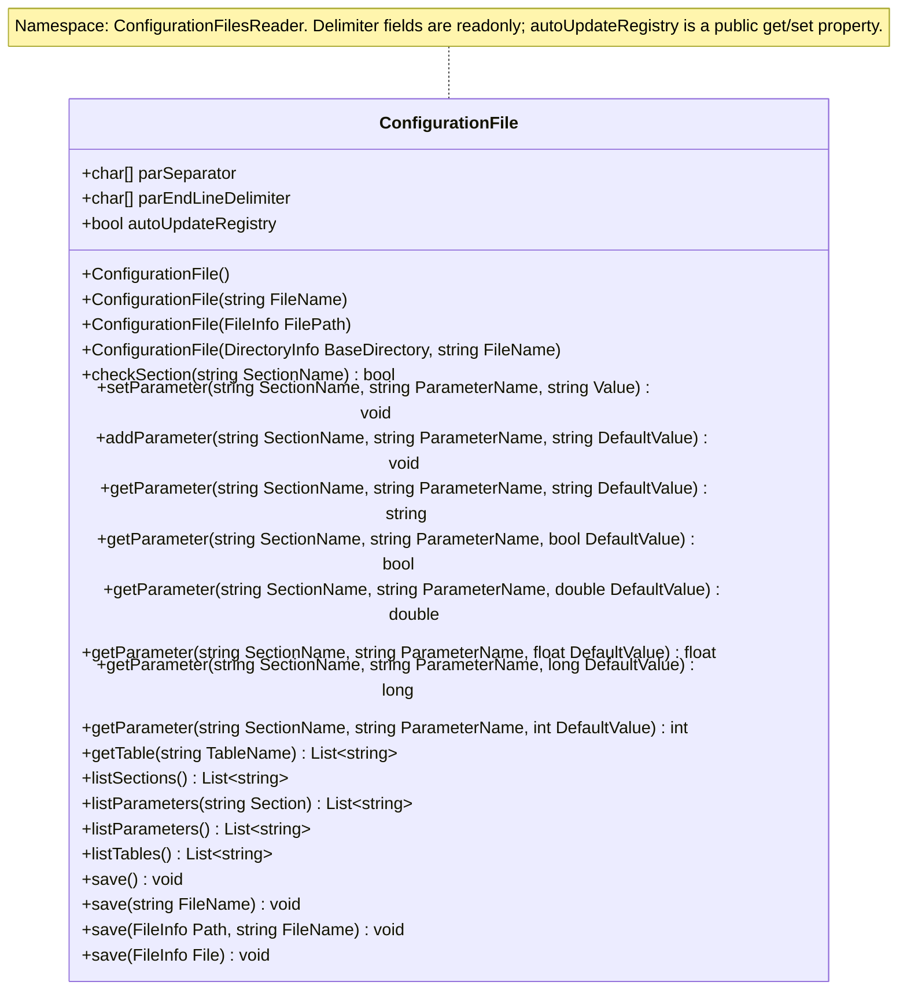

# IniLike

IniLike is a standalone C# library for reading INI-like configuration files with text tables. 
It targets .NET Framework 3.5. 
The namespace and assembly name are **ConfigurationFilesReader**, and the public class is `ConfigurationFilesReader.ConfigurationFile`.

## File format

```ini
## Full-line comment
[SERVER]
host = localhost;
port = 8080;
enabled = TRUE;

[DIRECTORIES]
data = ./data/;

[TABLE:ITEMS]
first; 10; active;
second; 20; inactive;
```

- `[SECTION]` contains `key = value` pairs.
- `[TABLE:NAME]` contains text rows. The library returns a `List<string>`;
  callers are responsible for splitting rows into columns.
- Section, key, and table names are **case-sensitive**. The `TABLE:` prefix
  must be uppercase. Sections and tables use separate dictionaries and may
  share a name.
- Blank lines and lines starting with `##` after trimming are ignored.
- Leading and trailing whitespace is trimmed from lines, section names, keys,
  and values. All trailing `;`, `,`, and `.` characters are then removed from
  values and table rows. Whitespace exposed by removing these delimiters is
  preserved.
- A key/value line must split into **exactly two parts** at `=`. Lines such as
  `expression = a=b;` are ignored.
- Quoting, escaping, multiline values, and inline comments are not supported.
  Quotes remain part of the value. A line such as `; comment` is treated as
  data inside a table.
- Duplicate sections, tables, or keys within a section cause an exception.
- Lines before the first section or table are ignored.
- Relative configuration file paths are resolved against the working directory.
  Paths stored as values are returned as text without resolution.

The trailing `.` delimiter can alter meaningful data: `value...` becomes `value`, and a single `.` becomes an empty string. 
Use `./` to represent the current directory. 
The parser supports the format described here rather than a complete INI specification.

## Usage

Reference `ConfigurationFilesReader.dll` and use the public API:

```csharp
using ConfigurationFilesReader;
using System.Collections.Generic;

var config = new ConfigurationFile("config.ini") { autoUpdateRegistry = true };
string host = config.getParameter("SERVER", "host", "localhost");
int port = config.getParameter("SERVER", "port", 8080);
bool enabled = config.getParameter("SERVER", "enabled", false);
List<string> items = config.getTable("ITEMS");

// Create or update a parameter in memory. The source file is unchanged.
config.setParameter("DIRECTORIES", "data", "./other-data/");
```

To create a configuration entirely in memory:

```csharp
var config = new ConfigurationFile { autoUpdateRegistry = true };
config.setParameter("SERVER", "port", "8080");
int port = config.getParameter("SERVER", "port", 80);
```

## API reference



File paths are stored internally as `System.IO.FileInfo`. 
Typed paths can be passed directly or combined with a filename:

```csharp
var fromString = new ConfigurationFile("config.ini");
var fromPath = new ConfigurationFile(new System.IO.FileInfo("config.ini"));
var fromDirectory = new ConfigurationFile(
    new System.IO.DirectoryInfo("settings"), "config.ini");
```

Relative paths are resolved against the working directory when their path objects are created. 

| Member | Behavior |
| --- | --- |
| `ConfigurationFile(string filename)` | Loads the file immediately. Missing files and parsing errors cause exceptions. |
| `ConfigurationFile(FileInfo FilePath)` | Loads the file represented by the typed path immediately. |
| `ConfigurationFile(DirectoryInfo BaseDirectory, string FileName)` | Combines the directory and filename and loads the resulting file immediately. |
| `ConfigurationFile()` | Creates an empty container without loading a file; automatic creation is disabled. |
| `checkSection(string)` | Checks for a section, excluding tables. Never creates sections or writes files. |
| `getParameter(section, key, string defaultValue)` | Returns the stored text, or the default if the section or key is missing. With `autoUpdateRegistry=true`, stores that missing default in memory, creating the section if needed. |
| `getParameter(..., bool)` | Only `TRUE`, ignoring case and surrounding whitespace, is true. Any other stored value is false, even when the default is true. |
| `getParameter(..., double/float)` | Parses using invariant culture after replacing commas with periods. Returns the default if parsing fails. |
| `getParameter(..., long/int)` | Parses an integer using invariant culture. Returns the default if parsing fails. The int overload parses as long and then performs an unchecked cast, so values outside the int range can wrap instead of returning the default. |
| `getTable(name)` | Returns the mutable internal list. For a missing table, returns a new empty list that is not attached to the container. |
| `listSections()` | Returns section names, excluding tables. |
| `listParameters(string Section)` | Returns parameter names in the specified section. Missing or empty sections return an empty list; null throws `ArgumentNullException`. |
| `listParameters()` | Returns distinct parameter names across all sections. The same name in multiple sections appears once; names differing in case remain distinct. |
| `listTables()` | Returns table names, excluding sections. |
| `save()` | Saves to the original file. Throws `InvalidOperationException` if constructed without a file. |
| `save(string FileName)` | Saves to the specified path, relative to the current working directory if not rooted. |
| `save(FileInfo Path, string FileName)` | Treats `Path.FullName` as a base directory and combines it with `FileName` using `System.IO.Path.Combine`. A rooted filename overrides the base directory. |
| `save(FileInfo File)` | Saves to the file represented by `File`. |
| `setParameter(string sectionName, string parameterName, string value)` | Replaces an existing value; creates missing sections and keys only when `autoUpdateRegistry=true`. Otherwise missing entries are left unchanged. Stores text without parsing or trimming and preserves case-sensitive names. Never writes files. |
| `addParameter(section, key, defaultValue)` | When `autoUpdateRegistry=true`, adds a missing parameter in memory and creates its section if needed; otherwise makes no changes. Preserves existing values, including null. Stores text unchanged and never writes files. Null section/key names throw `ArgumentNullException`; empty names are allowed. |


### Saving

```csharp
config.setParameter("SERVER", "host", "example.com");
config.save(); // Overwrite the original file.
config.save("copy.ini");
config.save(new System.IO.FileInfo("backup.ini"));
config.save(new System.IO.FileInfo("backups"), "config.ini");
```

All overloads save the current in-memory sections, parameters and table rows.
Explicit destinations do not change the original path used by `save()`. An
in-memory configuration always needs an explicit destination, even after its
first save. Parent directories must already exist; null arguments are rejected.

Output uses UTF-8 without a BOM, ordinally sorted section/parameter/table names,
and the current order of table rows. Comments, source ordering and original
formatting are not preserved. Saving uses the standard `=` separator and `;`
terminator regardless of mutations to the public delimiter arrays.

The writer closes a temporary file in the destination directory, reloads it with
the standard parser and checks that all names and values are preserved. Data the
format cannot represent (for example null values, values containing `=`, or
significant trailing punctuation) causes `InvalidOperationException` rather than
a lossy save. No quoting or escaping is introduced.

An existing destination is replaced with `File.Replace`; a new destination is
created with `File.Move`. Failed serialization or validation leaves the destination
untouched and temporary files are cleaned up. Filesystem errors propagate;
replacement requires filesystem support and does not fall back to truncating
the destination. Concurrent changes to a configuration are not supported.

## Limitations

The four listing methods return independent `List<string>` snapshots sorted with `StringComparer.Ordinal`. 
Changing a returned list does not modify the configuration; later in-memory changes are reflected only by a new call. Listing never creates sections or writes files. 
Parameter listings contain names, not values.

Delimiter settings are public readonly fields; `autoUpdateRegistry` is a public
get/set property:

```csharp
char[] separators = config.parSeparator;
char[] delimiters = config.parEndLineDelimiter;
bool automaticUpdates = config.autoUpdateRegistry;
config.autoUpdateRegistry = true;
```

The array references cannot be reassigned, but their elements remain mutable.
They default to `=` and `; , .`. Changing them after construction does not reload or change already parsed values. 
There is no public reload method.
`autoUpdateRegistry` defaults to false for every constructor. Set the property to true or false at any time to enable
or disable creation of missing entries. Changing it does not remove existing data
or write files. The delimiter fields have no accessor properties or setter methods.

`setParameter` supports in-memory overrides. Subsequent `getParameter` calls use the new values and the usual type conversions. 
Changes are persisted only by an explicit `save` call.

`addParameter` adds defaults only when a parameter is absent and automatic creation
is enabled; `setParameter` also replaces existing values in either mode.
Neither method writes files.

The flag controls only creation in the in-memory registry, not disk writes:

| Operation | `autoUpdateRegistry=false` (default) | `autoUpdateRegistry=true` |
| --- | --- | --- |
| `setParameter` | Updates existing parameters; missing entries are skipped. | Updates or creates parameters and their sections. |
| `addParameter` | Makes no changes. | Creates missing parameters and sections; preserves existing values. |
| `getParameter` (all overloads) | Returns defaults without storing them. | Stores missing defaults; later reads use the stored values. |

`checkSection`, `getTable`, and listing methods never create entries. This replaces
the old field name and changes setter creation behavior: callers that previously
relied on unconditional creation must set the property to true before adding entries.
Constructors do not accept an automatic-update argument; object initializers may
be used to set the property immediately after construction.
`checkSection` remains a pure existence check. 
Only the `save` methods write configuration changes to disk.

File readers and writers are disposed through `using` blocks, including on exceptions.
Concurrent changes are not synchronized.

## Build

With GNU Make and MSBuild installed, build from the repository root:

```sh
make ms-build
```

- `ms-build` is the default target: running `make` alone invokes MSBuild.
- `x-build` explicitly uses the deprecated Mono xbuild tool: `make x-build`.
- `clean` removes the library's entire `bin` and `obj` directories, including Debug, Release, and stale build artifacts: `make clean`.
- `test` runs the Python test runner, which builds its own temporary copy of the library. 
  Build and test default to Release; select Debug with `CONFIGURATION=Debug`, for example `make test CONFIGURATION=Debug`. 
  Tests also require Python 3; override its command with `PYTHON=python3` if needed.
- `IniLike.sln` contains the library project. 
  Build it with a toolchain that supports .NET Framework 3.5. 
  MSBuild must have access to the .NET Framework 3.5 reference assemblies and compatible build targets:

```sh
msbuild IniLike.sln /p:Configuration=Release
```

The resulting assembly is
`ConfigurationFilesReader/bin/Release/ConfigurationFilesReader.dll`.

Select build executables with `make ms-build MSBUILD=/path/to/msbuild` or
`make x-build XBUILD=/path/to/xbuild`. These variables accept executable paths,
not commands with arguments. Both build targets support `CONFIGURATION=Debug`.

## Automated tests

Prerequisites: Python 3, MSBuild, and Mono, with `msbuild`, `mcs`, and `mono` available on
`PATH`. No additional Python packages or test frameworks are required.

Run from the repository root:

```sh
make test
python3 tests/run.py
python3 tests/run.py --configuration Debug
python3 tests/run.py --msbuild /path/to/msbuild
```

`make test` uses MSBuild through the runner, independently of the build target
previously used. It forwards `CONFIGURATION` and uses `PYTHON`, but currently does
not forward `MSBUILD` or `XBUILD`. To choose a test build executable outside `PATH`,
invoke the runner directly with `--msbuild`. There is no automatic xbuild fallback.

The runner builds the solution from source in a temporary directory and tests the resulting assembly using `tests/ConfigurationFileTests.cs`. 
Each test runs in an isolated directory that is removed afterward. 
Tests verify that changing `autoUpdateRegistry` does not cause file writes.
Build artifacts are kept outside the repository. 
The command prints a result summary and exits with a nonzero status if a build or test fails.

The suite covers:

- Sections, tables, mutable lists, and transitions between sections and tables.
- Comments, whitespace, delimiters, Unicode, and case-sensitive names.
- Defaults for every getter overload, boolean conversion, and numeric conversion
  under three cultures, including integer boundaries and overflow behavior.
- Empty files, missing files, and duplicate sections, tables, and keys.
- In-memory overrides and source file preservation.
- The documented behavior of `addParameter`, the mutable `autoUpdateRegistry` property, and mutable elements of readonly delimiter arrays.
